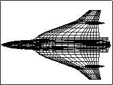
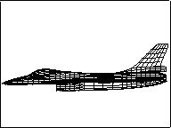
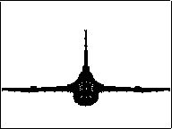

==================
Three View Program
==================

:Author: Ralph Carmichael

.. container:: crumb

   :doc:`PDAS home <index>` > :doc:`Contents <contents16>` >
   Three-View

.. container:: newbanner

   Public Domain Aeronautical Software (PDAS)  

.. container::
   :name: header

   .. rubric:: Three View Program
      :name: three-view-program

The premier program for making pictures in this collection is the hidden
line program. However, for many simple applications, it is simpler and
faster to make views of the configuration in plan view, side view and
rear or front view. Even though hidden lines are shown, they are not
usually as confusing as they are in isometric views. [Click on an image
below to see a 640x480 image]

=========== =========== ===========
|plan view| |side view| |rear view|
plan        side        rear
=========== =========== ===========

This simple program takes a configuration in :doc:`LaWGS <lawgs>`
format and produces several output files that may be used to visualize
your vehicle. The files plan.gnu, side.gnu, and rear.gnu are formatted
to be displayed with gnuplot or any other plotting package.

-  Go to the page of :doc:`references for the three-view <3viewrefs>`
   program.
-  Go to the :doc:`download page <3viewdownload>` for the three-view
   program.

Last updated: 9 July 2017 by Ralph Carmichael, pdaerowebmaster@gmail.com

.. container:: crumb

   :doc:`PDAS home <index>` > :doc:`Contents <contents16>` >
   Three-View

.. container:: newbanner

   Public Domain Aeronautical Software (PDAS)  

