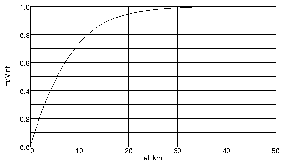

====================================
Thickness of the earth\'s atmosphere
====================================

:Author: Ralph Carmichael

.. container:: crumb

   :doc:`PDAS Home <index>` > :doc:`Contents <contents16>` >
   :doc:`Difficult Problems <diffprob>` > Atmosphere Thickness

.. container:: newbanner

   Public Domain Aeronautical Software (PDAS)  

.. container::
   :name: header

   .. rubric:: How Thick is the Earth\'s Atmosphere?
      :name: how-thick-is-the-earths-atmosphere

   Obtain an estimate for the thickness of the atmosphere of the earth.

This is not a good question because it does not have a precise answer.
The atmosphere gets less dense as you go up in altitude, but it never
quite goes to zero. Similar questions are: \"How long does it take for a
capacitor to discharge?\" or \"How long does it take for radioactive
material to decay?\". These are all examples of asymptotic behavior.
But, much in the same way that we make a definition that allows us to
speak of the thickness of a boundary layer in viscous fluid flow, we can
give a definition of the thickness of the atmosphere that satisfies our
engineering needs.

| To make this estimation, the first thing to do is to compute the mass
  distribution of the atmosphere. For a given altitude, define m(alt) to
  be the total mass of air from sea level up to alt over the entire
  earth. This is simply a matter of integrating the density of the
  atmosphere over the volume between a sphere of radius E and a sphere
  of radius alt+E, where E is the radius of the earth. You may examine
  my page that describes the numerical details of performing this
  numerical integration.
| `XHTML+MathML <atmmass.xml>`__, 5KB or `PDF <atmmass.pdf>`__, 44KB.

The results of this computation are shown in the table and chart below.
Note that m is given in zettagrams. One zettagram = 10**21 grams = 1 Zg.
Zetta is the prefix for 10**21, just as we use peta for 10**15 and tera
for 10**12, and Z stands for zetta when combining with an abbreviated
unit such as g for gram.

+-----------------------------------+-----------------------------------+
| +---------+---------+---------+   | |mass distribution|               |
| | alt     | m (Zg)  | m/      |   |                                   |
| | (km)    |         | m(in    |   |                                   |
| |         |         | finity) |   |                                   |
| +=========+=========+=========+   |                                   |
| | 0       | 0       | 0       |   |                                   |
| +---------+---------+---------+   |                                   |
| | 2       | 1.135   | 0.2147  |   |                                   |
| +---------+---------+---------+   |                                   |
| | 5       | 2.461   | 0.4655  |   |                                   |
| +---------+---------+---------+   |                                   |
| | 10      | 3.899   | 0.7376  |   |                                   |
| +---------+---------+---------+   |                                   |
| | 15      | 4.653   | 0.8801  |   |                                   |
| +---------+---------+---------+   |                                   |
| | 20      | 4.999   | 0.9455  |   |                                   |
| +---------+---------+---------+   |                                   |
| | 25      | 5.156   | 0.9752  |   |                                   |
| +---------+---------+---------+   |                                   |
| | 30      | 5.228   | 0.9888  |   |                                   |
| +---------+---------+---------+   |                                   |
| | 35      | 5.261   | 0.9950  |   |                                   |
| +---------+---------+---------+   |                                   |
| | 40      | 5.276   | 0.9979  |   |                                   |
| +---------+---------+---------+   |                                   |
| | 45      | 5.283   | 0.9993  |   |                                   |
| +---------+---------+---------+   |                                   |
| | 50      | 5.287   | 1.0000  |   |                                   |
| +---------+---------+---------+   |                                   |
+-----------------------------------+-----------------------------------+

Using boundary layer theory as an example, we can define the thickness
of the atmosphere to be the altitude that encloses 99 percent of the
total mass of the atmosphere. Looking at the chart, we can see that this
seems to be about 31 kilometers. The halfway point, where half the mass
of the atmosphere is below and half above occurs at 5.5 kilometers.
Another interesting fact is that when you are cruising in a modern jet
transport at 11 kilometers, you are above 77.5 percent of the
atmosphere. The total mass of the atmosphere turns out to be 5.3
zettagrams (5.3 Zg).

If we say that the thickness of the earth\'s atmosphere is 31km, we are
making a definition based on enclosing 99 percent of its mass. But this
is an arbitrary choice. If we define the thickness as enclosing 99.9
percent of the mass, the answer is 42km.

Another method for establishing this value is to compare the orbits of
objects entering the earth\'s atmosphere, either natural or man-made. At
high altitudes, the tracks are indistinguishable from Keplerian orbits
for a body in vacuum. Below a certain height, the paths differ from the
vacuum orbits. This height seems to be around 75 kilometers. When the
X-prize people were making the rules for the contest for putting a
manned craft into space, they rounded it to 100 km. If you demand that
the particle count per cubic meter be indistinguishable from the density
of the solar wind in the vicinity of the earth\'s orbit, you have to go
to something like 1000 km. Certainly it is apparent that the thickness
of the atmosphere is quite small compared to the diameter of the earth.
If you have seen my page on the subject :doc:`Why doesn\'t the atmosphere
fall to the ground? <nofall>`, you may agree with me that the
atmosphere has already fallen to the surface of the earth. It can\'t get
any closer. It is only because we are so small in the scale of the
universe that we perceive the atmosphere to be immense. It is tiny and
fragile.

If you find zettagrams, petabytes and femtoseconds a bit challenging,
have a look at the `NIST prefix
page <http://physics.nist.gov/cuu/Units/prefixes>`__.

Last updated: 9 July 2017 by Ralph Carmichael, pdaerowebmaster AT gmail
DOT com

.. container:: crumb

   :doc:`PDAS Home <index>` > :doc:`Contents <contents16>` >
   :doc:`Difficult Problems <diffprob>` > Atmosphere Thickness

.. container:: newbanner

   Public Domain Aeronautical Software (PDAS)  

